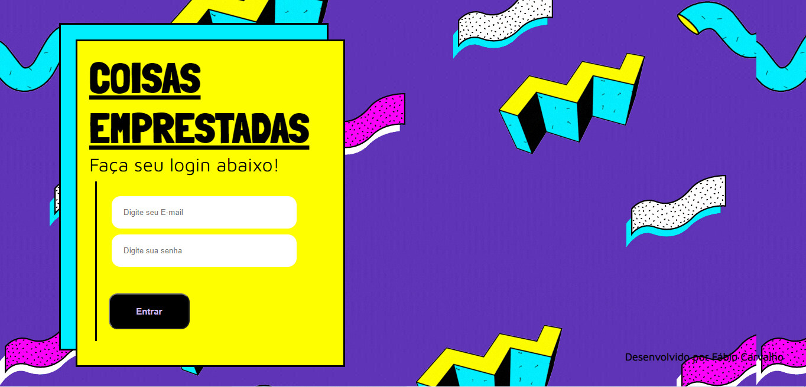

# Projeto_Coisas_Emprestadas
Trabalho desenvolvido para a disciplina de Fundamento da Programação Web, utilizando as seguintes tecs: MySQL, PHP, JavaScript, HTML5 e CSS3

# Login

 

# Início

 

# Produtos

 

# Cadastro

 

# Cadastro Produto

 
